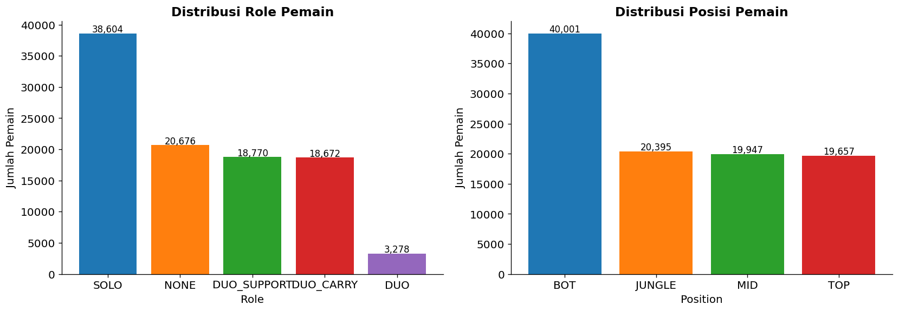
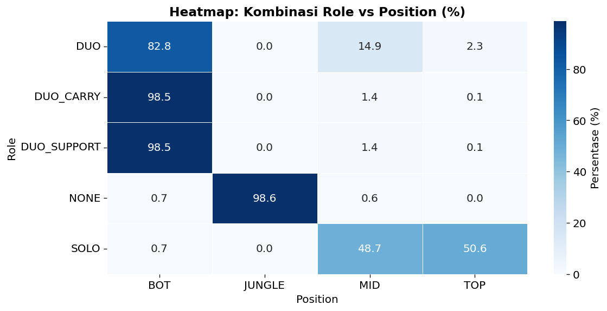
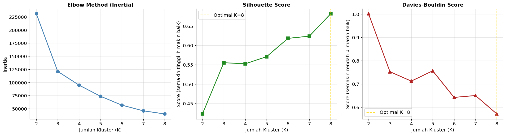
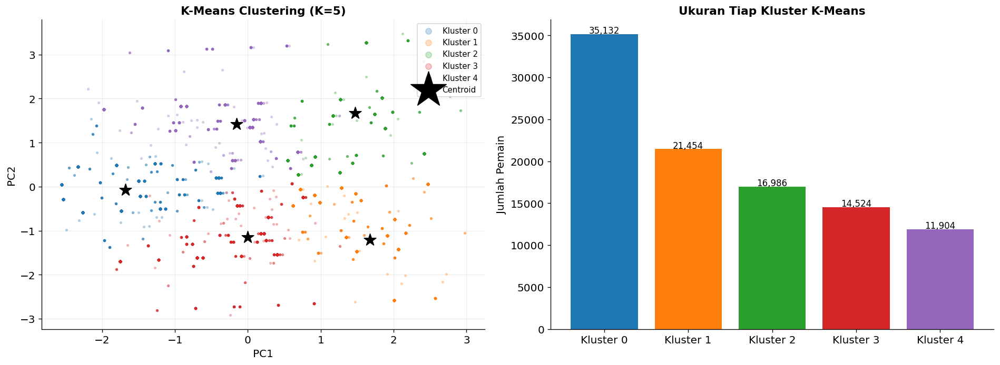
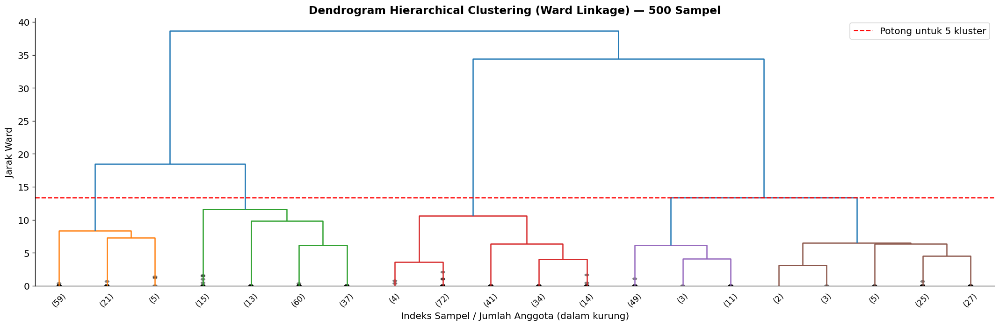
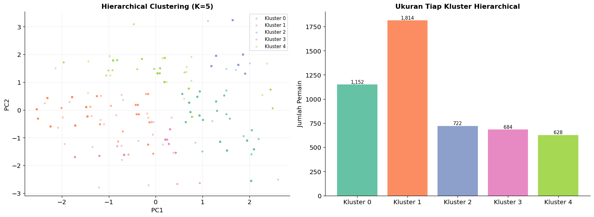
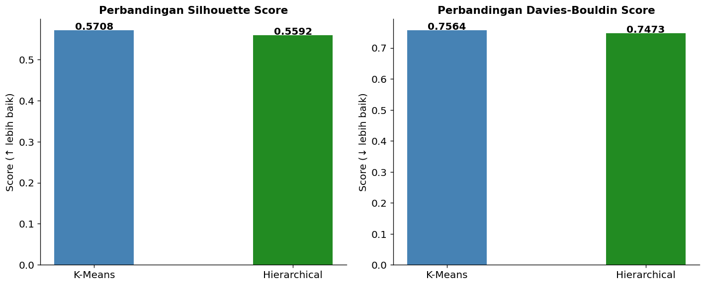
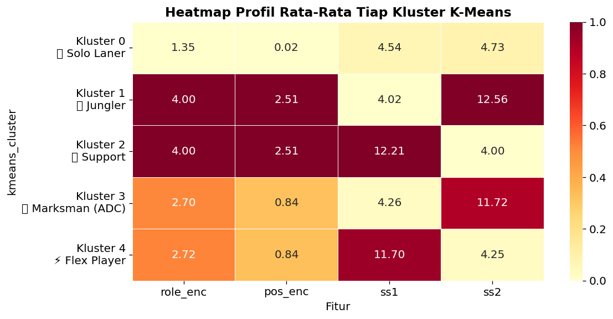

# 🎮 Segmentasi Gaya Bermain Pemain League of Legends Menggunakan K-Means dan Hierarchical Clustering

## 📌 Deskripsi Proyek

Proyek ini bertujuan mengidentifikasi pola dan segmentasi gaya bermain pemain League of Legends menggunakan teknik clustering unsupervised learning.

Dua metode clustering yang digunakan adalah:

- K-Means Clustering
- Hierarchical Clustering (Ward Linkage)

Hasil clustering digunakan untuk mengelompokkan pemain berdasarkan karakteristik permainan sehingga diperoleh segmen pemain dengan gaya bermain yang berbeda.

---

## 🎯 Tujuan Analisis

1. Mengidentifikasi kelompok pemain berdasarkan karakteristik permainan.
2. Membandingkan performa K-Means dan Hierarchical Clustering.
3. Menentukan metode clustering yang memberikan hasil terbaik.
4. Menginterpretasikan karakteristik setiap cluster yang terbentuk.

---

## 📊 Dataset

Dataset berasal dari statistik pertandingan League of Legends.

### Informasi Dataset

| Keterangan | Nilai |
|------------|---------|
| Jumlah Data Awal | 1.834.520 observasi |
| Sampel Analisis | 100.000 observasi |
| Metode Sampling | Random Sampling |
| Jenis Analisis | Unsupervised Learning |

### Variabel yang Digunakan

- Role
- Position
- Summoner Spell 1
- Summoner Spell 2

---

## 🔍 Tahapan Analisis

### 1. Data Preparation

- Membersihkan data
- Menangani missing value
- Encoding variabel kategorik
- Feature scaling

### 2. Exploratory Data Analysis (EDA)

Visualisasi yang dilakukan:

- Distribusi role pemain
- Distribusi position pemain
- Distribusi summoner spell
- Heatmap hubungan antar fitur

---

### 3. Penentuan Jumlah Cluster

Jumlah cluster ditentukan menggunakan:

- Elbow Method
- Silhouette Score

Hasil terbaik diperoleh pada:

**K = 5**

---

### 4. Clustering

#### K-Means

Mengelompokkan pemain berdasarkan centroid cluster.

#### Hierarchical Clustering

Menggunakan:

- Ward Linkage
- Euclidean Distance

---

### 5. Evaluasi Cluster

Metode evaluasi:

- Silhouette Score (semakin besar semakin baik)
- Davies-Bouldin Index (semakin kecil semakin baik)

---

## 📈 Hasil Evaluasi

| Metode | Jumlah Cluster | Silhouette Score | Davies-Bouldin |
|----------|----------|----------|----------|
| K-Means | 5 | 0.5708 | 0.7564 |
| Hierarchical Ward | 5 | 0.5592 | 0.7473 |

### Kesimpulan Evaluasi

- K-Means menghasilkan Silhouette Score lebih tinggi.
- Hierarchical menghasilkan Davies-Bouldin lebih rendah.
- Secara keseluruhan K-Means lebih stabil untuk dataset berukuran besar.

---

## 🎯 Segmentasi Gaya Bermain yang Ditemukan

| Cluster | Segmen |
|----------|----------|
| 0 | Solo Laner |
| 1 | Jungler |
| 2 | Support |
| 3 | Marksman (ADC) |
| 4 | Flex Player |

### Interpretasi Cluster

#### 🗡️ Cluster 0 – Solo Laner

Pemain yang dominan bermain pada lane atas maupun tengah.

#### 🌿 Cluster 1 – Jungler

Pemain yang berfokus pada area jungle dan objektif map.

#### 🛡️ Cluster 2 – Support

Pemain yang berperan membantu ADC dan tim melalui utility.

#### 🏹 Cluster 3 – Marksman (ADC)

Pemain dengan fokus damage jarak jauh dan carry tim.

#### ✨ Cluster 4 – Flex Player

Pemain yang fleksibel memainkan berbagai role dan posisi.

---

## 📷 Visualisasi Hasil

### Distribusi Role



### Heatmap Fitur



### Evaluasi K-Means



### Hasil K-Means



### Dendrogram Hierarchical



### Hasil Hierarchical



### Perbandingan Metode



### Profil Cluster



---

## 🛠️ Tools dan Library

### Python

- pandas
- numpy
- matplotlib
- seaborn
- scikit-learn
- scipy

### Visual Studio Code

Digunakan untuk pengolahan data dan visualisasi.

---

## 📂 Struktur Repository

```
.
├── LoL_Segmentasi_Gaya_Bermain.ipynb
├── Laporan_Clustering_LoL.pdf
├── Laporan_Clustering_LoL.docx
├── cluster_profile_heatmap.png
├── comparison.png
├── dendrogram.png
├── eda_heatmap_role_position.png
├── eda_role_position.png
├── eda_summoner_spells.png
├── hierarchical_result.png
├── kmeans_evaluation.png
├── kmeans_result.png
└── README.md
```

---

## 📌 Kesimpulan

Analisis clustering berhasil mengidentifikasi lima segmen utama pemain League of Legends yang merepresentasikan role dan gaya bermain berbeda.

Metode K-Means memberikan performa terbaik untuk dataset berukuran besar karena memiliki nilai Silhouette Score tertinggi dan proses komputasi yang lebih efisien dibandingkan Hierarchical Clustering.

---

## 👨‍💻 Penulis

Muhamad Hambali

Proyek Analisis Data Mining & Clustering
